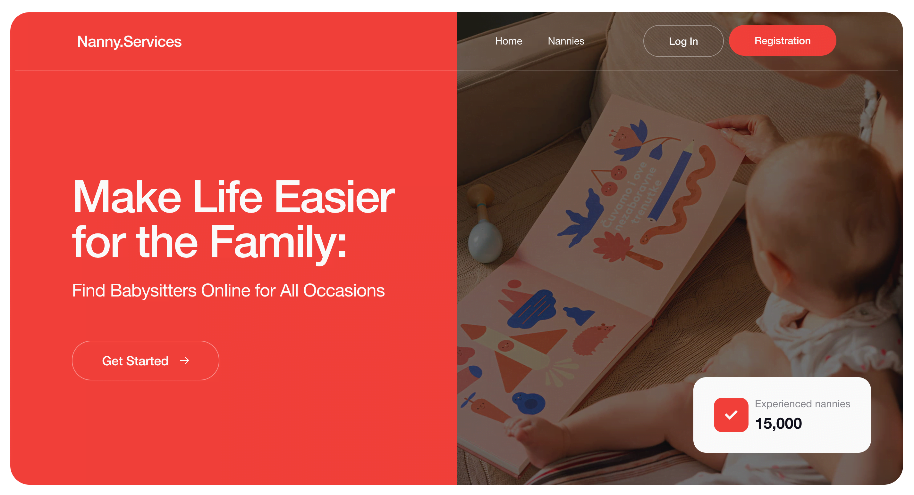

<h1 align="center"> Nanny Services 🧸</h1>

---

## 📌 Description

**Nanny Services** is a modern and responsive web application designed to help families find and
hire professional babysitters for any occasion. The platform allows users to browse a comprehensive
catalog of nannies, filter them by various criteria, save favorite profiles to a personal list, and
securely manage their accounts through an integrated authentication system.

---

## 🔗 Preview

  

  <a href="">🌐 Live Demo</a> •
  <a href="https://github.com/LiliiaDud/nannies-services-app">📁 GitHub Repository</a>

---

## Key Features & Technical Requirements

- **Nanny Catalog**: Browse available nannies with detailed information, including age, work
  experience, education, hourly rate, rating, and client reviews.
- **Filtering & Sorting**: Conveniently filter and sort the nanny list by various parameters.
- **Favorites System**: Authorized users can save and manage their favorite nannies, with local data
  synchronization.
- **User Authentication**:
  - New account registration.
  - Secure login with credential verification.
  - Logout functionality with automatic state cleanup and redirection to the home page.
- **Modals & Mobile Menu**: User-friendly popups for login, registration, and a responsive mobile
  menu featuring backdrop support and outside-click handling.
- **Responsive Design**: Fully optimized UI/UX across mobile devices, tablets, and desktop screens
  using custom CSS Modules.

---

## Technologies Used

- **Frontend**: React, TypeScript, React Router DOM
- **Forms & Validation**: React Hook Form, Yup
- **Styling**: CSS Modules, Responsive Media Queries
- **Authentication & Database**: Firebase SDK (Authentication)
- **Notifications**: React Toastify
- **Bundler**: Vite

---

### Author

**Liliia Dudnyk** [@Liliia Dudnyk](https://github.com/LiliiaDud)  
 Fullstack Developer
